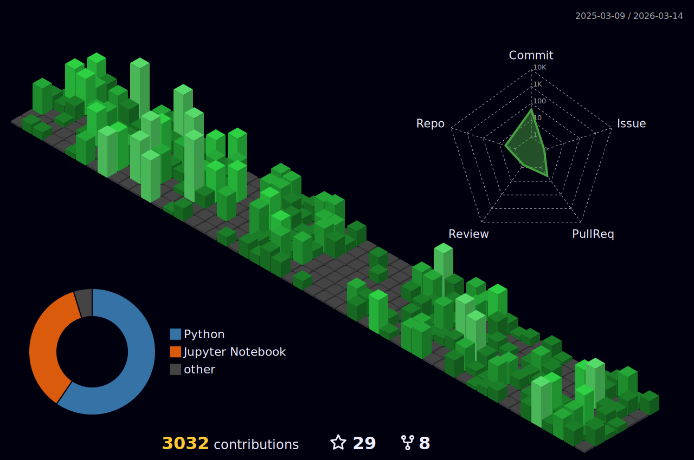

<h1 align="center">Hello , I'm Abdelrahman</h1>

## 🙋‍♂️ About Me:

- 🌱 I’m currently learning **Backend development using Django framework.**

- ✒️ I'm currently a master degree computer science student

- 👯 I’m looking to collaborate on **OpenSource Projects**.

- 👨‍💻 All of my projects are available at **[My Repository’s ](https://github.com/Abdurahman-hassan?tab=repositories)**.
  
 

## 🚀 Languages and Tools:

 
 

 

 

  
 

 

 

##
  

##

  

  

<b>Note:</b> Top languages is only a metric of the languages my public code consists of and doesn't reflect experience or skill level.
  
 

##

## 📊 My Github Stats:

<a href="https://github.com/Abdurahman-hassan/">

<a href="https://github.com/Abdurahman-hassan/">

  

##

## 🔗 Connect with me:

