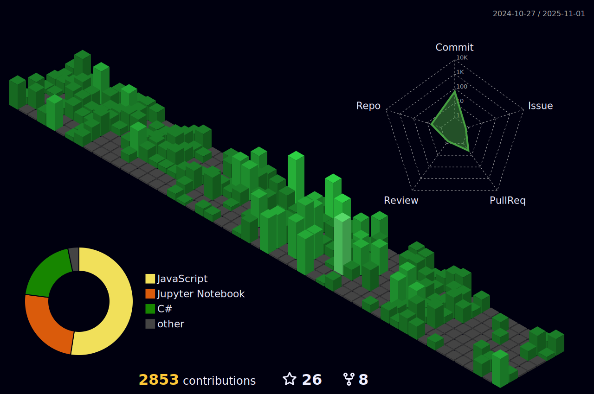

<h1 align="center">Hello , I'm Abdelrahman</h1>

## 🙋‍♂️ About Me:

- 👨‍💻 Senior Backend Engineer specialized in **Python, Django, FastAPI, Flask, Celery, and PostgreSQL**, passionate about building scalable, high-performance distributed systems.

- 🚀 Currently working on large-scale **energy-tech trading systems**, focusing on backend architecture, task orchestration, and system optimization.

- 📚 Completing my **Postgraduate Diploma in Computer Science** at Cairo University, continuously advancing my backend and DevOps expertise.

- 👥 Experienced mentor & trainer — supported and trained **250+ developers** through professional workshops and technical mentorship programs.

- 🤝 Open-source contributor with an entrepreneurial mindset — leading and supporting backend-focused solutions and impactful projects.

- 🌍 Interested in advanced system design, automation, data-driven architectures, and cloud technologies.

- 🔗 Explore my work on GitHub: **[My Repositories](https://github.com/Abdurahman-hassan?tab=repositories)**

  
## 💻 Technologies I'm Mastering

🛠️ Advancing my expertise in **DevOps and Cloud Engineering**, focusing on:
- AWS & Google Cloud
- Kubernetes & Docker
- CI/CD automation (Jenkins, GitHub Actions)
- Infrastructure as Code (Terraform)
- Monitoring & Logging (Prometheus, Grafana, ELK)

## 🌟 Future Goals

🚀 Expand my distributed systems and cloud-native skills by learning:
- **Go (Golang)** and backend frameworks like **Gin**
- Advanced Kubernetes orchestration & scaling strategies
- High-performance messaging and event-driven architectures
 

## 🚀 Languages & Tools

<!-- Programming Languages -->
### 🧠 Programming Languages

  
  
  
  

### ⚙️ Backend Frameworks & Tools

  
  
  
  
  
  

### 🗄️ Databases & Caching

  
  
  
  

### ☁️ Cloud & DevOps

  
  
  
  
  
  

### 🔄 Cloud Messaging, Event-Driven & Distributed Systems

  <!-- Amazon S3 -->
  
  <!-- API GateWay -->
  
  <!-- Amazon SQS -->
  
  <!-- E2E Testing -->
  

### 💡 Tools & IDEs

  
  
  
  

##
  

##

  

  

<b>Note:</b> Top languages is only a metric of the languages my public code consists of and doesn't reflect experience or skill level.
  
 

##

## 📊 My Github Stats:

<a href="https://github.com/Abdurahman-hassan/">

<a href="https://github.com/Abdurahman-hassan/">

  

##

## 🔗 Connect with me:

